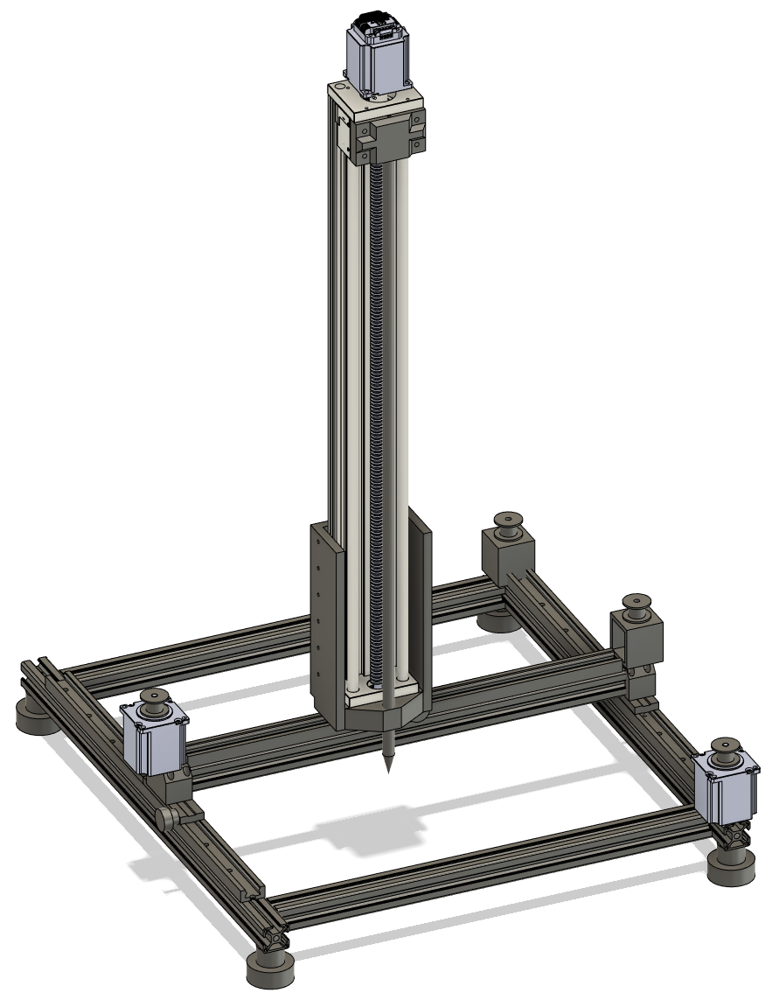

# ECE445 Micro-Penetrometer for Snow and Soil Structural Analysis

## Project Overview

This project developed an advanced micro-penetrometer system for detailed analysis of soil and snow structures. The system integrates precision motors, force sensing, and wireless communication to enable accurate penetration testing and data collection.

Key features:
- 3-axis motorized control for precise probe positioning and penetration 
- Force sensor for measuring penetration resistance
- Bluetooth communication for wireless control and data transfer
- Custom control software for operation and data visualization

## System Components

- Mechanical system with 3 stepper motors (2 for XY positioning, 1 for Z-axis penetration)
- STM32F407 microcontroller for system control
- Force sensor (DYMH-106) for penetration force measurement
- Bluetooth module (ATK-MW579) for wireless communication
- Custom control program with GUI for device operation and data analysis

## Key Capabilities 

- Precise probe positioning across a 7x7 grid
- Penetration depth up to 50 cm 
- Real-time force measurement during penetration
- Wireless control via custom software interface
- Data logging and visualization of penetration force vs depth

## Usage

1. Connect to device via Bluetooth using control software
2. Use grid interface to position probe 
3. Initiate penetration test
4. View real-time force data
5. Generate force vs depth plots for analysis

## Repository Contents

- `/Bluetooth+Motors+adc`: STM32 firmware code
- `/Control Program`: Python-based control software  
- `/Report`: Detailed project documentation

- ## Team

  - Chenghao Mo ([cmo8@illinois.edu](mailto:cmo8@illinois.edu))
  - Xing Shen ([xings2@illinois.edu](mailto:xings2@illinois.edu))
  - Zheyan Wu ([zheyanw2@illinois.edu](mailto:zheyanw2@illinois.edu))
  - Chenxian Meng ([cmeng10@illinois.edu](mailto:cmeng10@illinois.edu))
